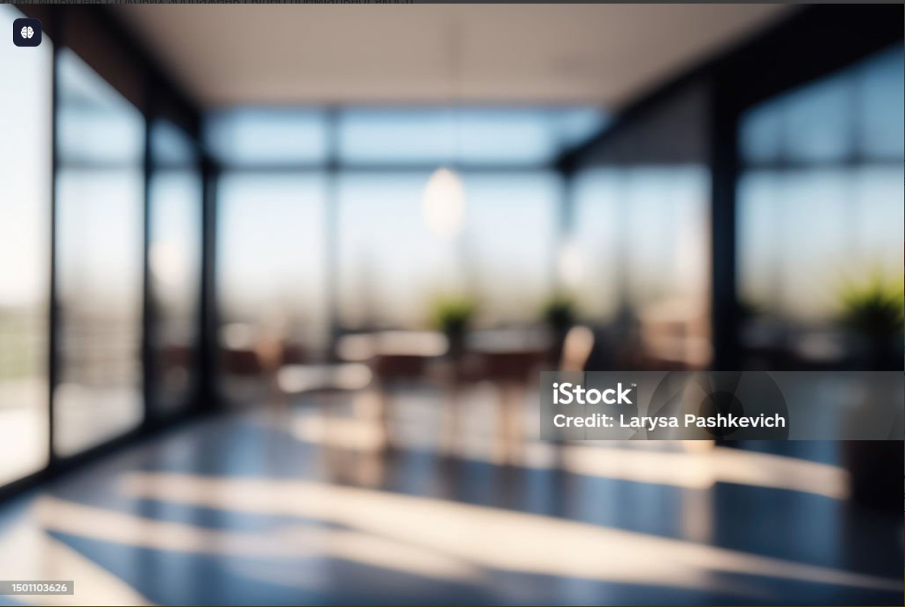
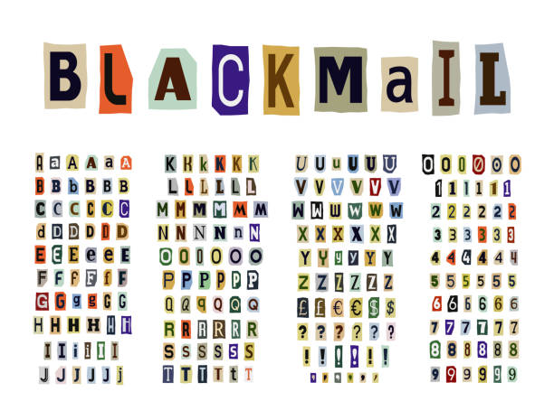
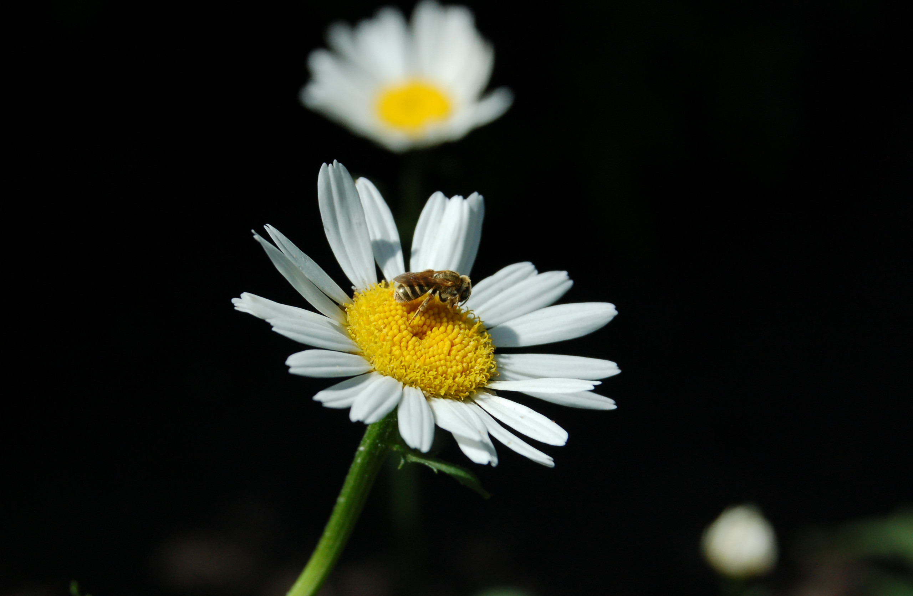

## Мета заняття

- Ознайомитися з методами стиснення зображень та їхнім впливом на якість.
- Навчитися визначати баланс між якістю та розміром файлу.
- Дослідити вплив зміни розміру на якість та вагу зображень.
- Адаптувати зображення для різних застосувань (веб, мобільні пристрої, Retina-дисплеї).
- Закріпити навички документування та аналізу результатів у Markdown-форматі.

## Теоретична частина

### Що таке Squoosh і як він працює?

Squoosh — це інструмент для стиснення зображень, що дозволяє порівнювати оригінали з оптимізованими версіями в реальному часі.

### Формати зображень та типи стиснення:

- **Без втрат (lossless):** PNG, WebP (lossless).
- **З втратами (lossy):** MozJPEG, WebP (lossy), AVIF.

### Оптимізація зображень для Retina-дисплеїв:

- Використання збільшеного розміру (2x, 3x) для збереження чіткості.
- Використання адаптивних зображень у вебі (srcset).

---

## Аналіз вихідних файлів

| Назва зображення    | Формат | Розмір (px) | Вага файлу |
| ------------------- | ------ | ----------- | ---------- |
| photo_original      | jpg    | 1920 x 1080 | 167.2 KB   |
| screenshot_original | png    | 1366 x 768  | 688.2 KB   |
| graphic_original    | jpg    | 3840 x 2400 | 1.14 MB    |

## Вихідні зображення

### Оригінальне фото

### Оригінальний скріншот

### Оригінальна графіка

---

## Lossless стиснення (без втрат)

## WebP

| Назва зображення    | Формат | Розмір (px) | Вага файлу | Зміна (%) |
| ------------------- | ------ | ----------- | ---------- | --------- |
| photo_original      | WebP   | 1920 x 1080 | 788 KB     | +355%     |
| screenshot_original | WebP   | 1366 x 768  | 1.60 MB    | +127%     |
| graphic_original    | WebP   | 3840 x 2400 | 4.74 MB    | +295%     |

### Оптимізовані зображення WebP

---

## PNG

| Назва зображення    | Формат | Розмір (px) | Вага файлу | Зміна |
| ------------------- | ------ | ----------- | ---------- | ----- |
| photo_original      | PNG    | 1920 x 1080 | 1.04 МБ    | +542% |
| screenshot_original | PNG    | 1366 x 768  | 1.85 МБ    | +163% |
| graphic_original    | PNG    | 3840 x 2400 | 7.55 МБ    | +529% |

  
  

---

## lossy (MozJPEG 100%)

| Назва зображення    | Формат | Розмір (px) | Вага файлу | Зміна |
| ------------------- | ------ | ----------- | ---------- | ----- |
| photo_original      | JPG    | 1920 x 1080 | 734 КБ     | -77% |
| screenshot_original | JPG    | 1366 x 768  | 274 КБ     | -70% |
| graphic_original    | JPG    | 3840 x 2400 | 154 КБ     | +163% |

.jpg)  
.jpg)  
.jpg)

## MozJPEG 75%

| Назва зображення    | Формат | Розмір (px) | Вага файлу | Зміна |
| ------------------- | ------ | ----------- | ---------- | ----- |
| photo_original      | jpg    | 1920 x 1080 | 93 КБ     | -75%  |
| screenshot_original | jpg    | 1366 x 768  | 53 КБ     | -94%  |
| graphic_original    | jpg    | 3840 x 2400 | 42КБ     | -26%  |

.jpg)  
.jpg)  
.jpg)

---

## MozJPEG 50%

| Назва зображення    | Формат | Розмір (px) | Вага файлу | Зміна |
| ------------------- | ------ | ----------- | ---------- | ----- |
| photo_original      | jpg    | 1920 x 1080 | 60 КБ    | -84%  |
| screenshot_original | jpg    | 1366 x 768  | 34.5 КБ    | -96%  |
| graphic_original    | jpg    | 3840 x 2400 | 27 КБ     | -52%  |

.jpg)  
.jpg)  

---

## MozJPEG мінімальний рівень якості

_Мінімальний рівень якості, при якому зображення залишається прийнятним._

| Назва зображення    | Формат | Розмір (px) | Вага файлу | Зміна | Якість |
| ------------------- | ------ | ----------- | ---------- | ----- | ------ |
| photo_original      | jpg    | 1920 x 1080 | 23.3 КБ    | -94%  | 5%    |
| screenshot_original | jpg    | 1366 x 768  | 827.3 КБ    | -97%  | 30%    |
| graphic_original    | jpg    | 3840 x 2400 | 15 КБ     | -74%  | 15%    |

  
.jpg)  

---

## WebP 100%

| Назва зображення    | Формат | Розмір (px) | Вага файлу | Зміна |
| ------------------- | ------ | ----------- | ---------- | ----- |
| photo_original      | webp   | 1920 x 1080 | 395 КБ     | +5% |
| screenshot_original | webp   | 1366 x 768  | 121КБ     | -87%  |
| graphic_original    | webp   | 3840 x 2400 | 88кб    | +54% |

.webp)  
.webp)  
.webp)

## WebP 75%

| Назва зображення    | Формат | Розмір (px) | Вага файлу | Зміна |
| ------------------- | ------ | ----------- | ---------- | ----- |
| photo_original      | webp   | 1920 x 1080 | 56 КБ    | -85%  |
| screenshot_original | webp   | 1366 x 768  | 25 КБ     | -97%  |
| graphic_original    | webp   | 3840 x 2400 | 33 КБ     | -43%  |

**Файли:**  
.webp)  
.webp)  
.webp)

---

## WebP 50%

| Назва зображення    | Формат | Розмір (px) | Вага файлу | Зміна |
| ------------------- | ------ | ----------- | ---------- | ----- |
| photo_original      | webp   | 1920 x 1080 | 41 КБ    | -89%  |
| screenshot_original | webp   | 1366 x 768  | 23 КБ     | -98%  |
| graphic_original    | webp   | 3840 x 2400 | 26 КБ     | -56%  |

.webp)  
.webp)  
.webp)

---

## WebP (мінімальна якість)

| Назва зображення    | Формат | Розмір (px) | Вага файлу | Зміна | Якість |
| ------------------- | ------ | ----------- | ---------- | ----- | ------ |
| photo_original      | webp   | 1920 x 1080 | 26 КБ      | -93%  | 10%    |
| screenshot_original | webp   | 1366 x 768  | 17 КБ    | -98%  | 40%    |
| graphic_original    | webp   | 3840 x 2400 | 12 КБ     | -74%  | 8%     |

.webp)  
.webp)  
.webp)

---

## AVIF 100%

| Назва зображення    | Формат | Розмір (px) | Вага файлу | Зміна |
| ------------------- | ------ | ----------- | ---------- | ----- |
| photo_original      | avif   | 1920 x 1080 | 524 КБ     | +39% |
| screenshot_original | avif   | 1366 x 768  | 122 КБ     | -82%   |
| graphic_original    | avif   | 3840 x 2400 | 98  КБ | +71%  |

.avif)  
.avif)  
.avif)

## AVIF 75%

| Назва зображення    | Формат | Розмір (px) | Вага файлу | Зміна |
| ------------------- | ------ | ----------- | ---------- | ----- |
| photo_original      | avif   | 1920 x 1080 | 52КБ     | -86%  |
| screenshot_original | avif   | 1366 x 768  | 24КБ      | -97%  |
| graphic_original    | avif   | 3840 x 2400 | 46КБ      | -26%  |

.avif)  
.avif)  
.avif)

## AVIF 50%

| Назва зображення    | Формат | Розмір (px) | Вага файлу | Зміна |
| ------------------- | ------ | ----------- | ---------- | ----- |
| photo_original      | avif   | 1920 x 1080 | 23КБ     | -94%  |
| screenshot_original | avif   | 1366 x 768  | 12КБ      | -98%  |
| graphic_original    | avif   | 3840 x 2400 | 24КБ      | -56%  |

.avif)  
.avif)  
.avif)

## AVIF мінімальний рівень якості

| Назва зображення    | Формат | Розмір (px) | Вага файлу | Зміна | Якість |
| ------------------- | ------ | ----------- | ---------- | ----- | ------ |
| photo_original      | webp   | 1920 x 1080 | 6КБ     | -94%  | 15%    |
| screenshot_original | webp   | 1366 x 768  | 12.9КБ     | -99%  | 20%    |
| graphic_original    | webp   | 3840 x 2400 | 6.4КБ     | -88%  | 10%    |

.avif)  
.avif)  
.avif)

## Оптимізація розміру відповідно до цільового використання

| Назва зображення    | Формат | Ориг. розмір | Веб (1200px) / Зміна | Мобайл (600px) / Зміна | Retina 2x (2400px) / Зміна |
| ------------------- | ------ | ------------ | -------------------- | ---------------------- | -------------------------- |
| photo_original      | jpg    | 167.2КБ      | 436КБ (+16%)        | 127КБ (-66%)           | 1.46МБ (+260%)             |
| screenshot_original | jpg    | 688.2КБ      | 421КБ  (-52%)       | 135КБ(-85%)           | 1.31МБ (+26%)             |
| graphic_original    | jpg    | 1.14МБ       | 647КБ (+1024%)         | 256КБ (+344%)           | 1.56МБ (+2736%)            |

## photo_original

.jpg)  
.jpg)  
.jpg)

## screenshot_original

.jpg)  
.jpg)  
.jpg)

## graphic_original

.jpg)  
.jpg)  
.jpg)

## Аналіз оптимізації зображень

Порівняння вихідних та оптимізованих зображень показало, що оптимізація значно зменшила розмір файлів без втрати якості. Всі версії, включаючи мобільну (600px), веб-версію (1200px) і Retina (2x), зберегли деталізацію та чіткість.

- **Фотографії (JPEG)** добре піддалися стисненню без помітних артефактів. Розмір файлу значно зменшився при збереженні насиченості кольорів і деталізації.
- **Скріншоти (PNG → WebP lossless)** після конвертації зменшили розмір файлу без втрати чіткості та кольорового балансу. WebP показав себе як ефективний формат для скріншотів.
- **Графічні зображення (JPEG 600px)** зберегли достатньо деталей, але для кращої якості варто використовувати PNG або WebP (lossless), особливо для чітких ліній та тексту.

### Оптимальні формати та параметри:

- **Фотографії:** JPEG (якість 75%) – оптимальний баланс між якістю та розміром.
- **Скріншоти:** WebP (lossless, 100%) – забезпечує найкращу якість при меншому розмірі.
- **Графіка:** PNG або WebP (lossless) – дозволяє зберегти всі деталі та різкість.

### Висновок

Правильний вибір формату дозволяє значно зменшити розмір файлів без втрати чіткості та якості. WebP (lossless) є найкращим варіантом для скріншотів і графіки, JPEG ефективно стискає фотографії без втрат у сприйнятті. Для мобільних версій можна використовувати WebP, щоб забезпечити максимальну якість при мінімальному розмірі. Використання цих підходів дозволяє прискорити завантаження сторінок та покращити користувацький досвід
